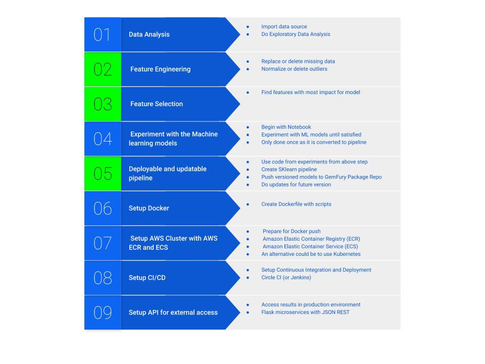

# Deployment pipeline of Machine Learning Models

---

A deployment pipeline for machine learning models using model versioning, CI/CD and serving it through a Flask JSON API.

First version include a simple regression based ML model based on housing price data that is retrieved from Kaggle. 

The created models are deployed on Gemfury (with versions and requirements) to be able to track incremental (or decremental) changes in the trained model.

The modeling part has a lot more internal steps than shown, but here we a concentrating on the full pipeline that can be used in production for ML.

## Steps for the project are:

 
 

Rinse and repeat only steps 2,3 and 5 (in Green) for future versions of ML models with automated steps.

## Stack used:

* **AWS ECR and ECS** (Perhaps replace with Kubernetes, time will tell) 
* **Docker** Packaging for deployment
* **Github** Code Repository
* **Pyhon Notebooks** For experimentation before conversion to pipeline
* **GemFury** Cloud Package repository
* **CircleCI** For Continuous Integration
* **Flask**  JSON API
* **Kaggle** Training data

**+ Various ML tools.**

### Future steps
* **Dashboard** using Dash and Plotly 
* **Deep learning model** On a more powerful AWS machine and lots of time
* **Reformat this page** so it is cleaner,BTW thanks for reading so far.. 
* **An architectural view** So you get the point of the project faster.

Buggy and lots of bugs, but getting there.

  
